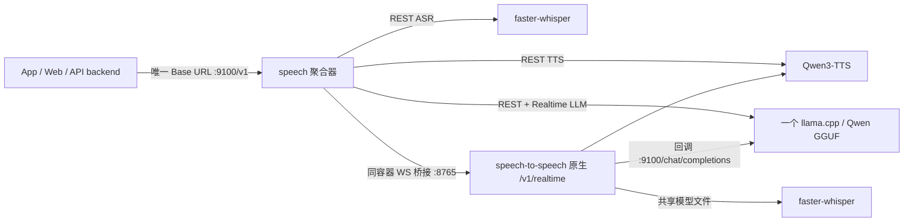

# RealTalk 本地实时语音模型服务器

一个 `speech` 容器：**ASR（faster-whisper）+ LLM（llama.cpp GGUF）+ 统一 Qwen3-TTS +
speech-to-speech Realtime**。对外只暴露一个 **OpenAI 兼容 API** 地址
`http://<IP>:9100/v1`，RealTalk api 后端与管理台无需分别填写内部容器地址。

一次完整语音对话实际经过三种不同模型：

1. **Whisper / ASR**：把麦克风声音转成文字；模型越大通常识别越准、也越慢。
2. **Qwen GGUF / LLM**：理解文字并生成 AI 回复。
3. **TTS**：`/audio/speech` 与 `/realtime` 都使用部署时选择的 **Qwen3-TTS** 模型和音色
   （CPU 默认 0.6B CustomVoice / Q4_K_M）。

## 实际拓扑与复用边界



- **真正进程内共用**：所有 REST 文字请求和 realtime 的 LLM 都走聚合器中的同一个
  llama.cpp / GGUF 实例，不重复加载语言模型。
- **共享下载目录、分别加载**：REST 与 speech-to-speech 是不同的 Python 运行时，不能安全共用
  一个 faster-whisper 内存对象；但两者都使用 `/models/faster-whisper-<size>`，不会重复下载。
- **统一 TTS 配置**：REST 与 realtime 使用相同 Qwen3-TTS 模型、量化和默认 speaker，声音一致。
  原生 S2S 是独立进程，模型文件共用；`SPEECH_S2S_PIPELINES=1` 避免额外复制实时管线。
- 不使用 Python venv：Docker 镜像本身就是隔离环境。`speech-to-speech` 的编排是
  **VAD → STT → LLM → TTS**，不是单一端到端权重。

## 安装

```bash
# setup.sh 里选择「安装本地实时语音模型」即可；或手动（默认原生实时模式）：
COMPOSE_PROFILES=speech docker compose -f docker-compose.yml -f docker-compose.speech.yml up -d --build
```

参数全部走 `.env`（每节点部署项，不入库、不进管理台）：

| 变量 | 默认 | 说明 |
|---|---|---|
| `SPEECH_DEVICE` | `cpu` | `cpu` / `cuda`（GPU 需 nvidia-container-toolkit） |
| `SPEECH_LLAMA_CPU_PORTABLE` | `true` | CPU 源码构建便携 llama.cpp，关闭 AVX2/FMA 以兼容旧 Xeon；设 `false` 可用预编译 wheel 加快镜像构建，但 CPU 必须支持其指令集 |
| `SPEECH_ASR_MODEL` | `small` | whisper 尺寸：tiny/base/small/medium/large-v3 |
| `SPEECH_LLM_REPO` / `SPEECH_LLM_FILE` | Qwen2.5-1.5B-Instruct Q4 | GGUF 模型仓库/文件（FILE 也可填绝对路径） |
| `SPEECH_REALTIME_ENGINE` | `s2s` | `s2s`=speech-to-speech 原生实时通道；`legacy`=应急回退旧内建实现 |
| `SPEECH_TTS_MODEL` | Qwen3-TTS 0.6B CustomVoice | REST 与实时统一模型；质量优先可换 1.7B |
| `SPEECH_TTS_SPEAKER` | `Aiden` | REST 与实时统一音色；中文可填 `Vivian` / `Serena` / `Uncle_Fu` 等 |
| `SPEECH_TTS_QUANT` | `Q4_K_M` | CPU GGUF 量化；降低内存占用 |
| `SPEECH_TTS_ALLOW_REQUEST_VOICE` | `false` | 默认忽略 REST `voice`，保证与 realtime 音色一致；需要多音色时才开启 |
| `SPEECH_S2S_PIPELINES` | `1` | 原生实时并发管线数；每条都要加载 ASR/TTS，CPU 请保持 1 |
| `SPEECH_MODELS_DIR` | `./speech-models` | faster-whisper、LLM GGUF、Qwen3-TTS GGUF/HuggingFace 缓存统一持久化目录 |
| `HF_ENDPOINT` | 空 | 受限网络填 `https://hf-mirror.com` |
| `SPEECH_ASR_CONCURRENCY` / `SPEECH_TTS_CONCURRENCY` | 3 / 6 | ASR/TTS 并发上限，超出排队 |
| `SPEECH_LLM_CONCURRENCY` | **1（勿改大）** | llama.cpp 进程内单实例非线程安全，>1 会崩；高并发用 `SPEECH_LLM_BASE_URL` 代理外部 llama-server 或多副本 |
| `SPEECH_LLM_BASE_URL` | 空 | 设了则 LLM 代理外部 OpenAI 兼容服务（不在本进程加载，可并发） |
| `SPEECH_CTX_TTL_SECONDS` | 300 | **仅 legacy**：实时上下文 Redis 滑动 TTL（5 分钟；主动结束即删） |

**实时通道 `WS /v1/realtime`** 由原生 `speech-to-speech` 执行。它保持 OpenAI Realtime 事件，聚合器补齐旧后端需要的词列表/PCM 采样率字段，故现有 App 协议无需改动。两种轮次形态（`session.update` 决定）：
- 默认回合制：`commit` 判停 + `response.create` 触发回复（客户端掌控节奏，用于点按对话/严格场景）；
- `turn_detection={"type":"server_vad"}` 全双工（GPT-Live/OpenAI Realtime 式）：连续上行、服务端 VAD 自动断句+自动回复+起声打断（用于私教沉浸式/实时翻译）。

## API 调用方式（OpenAI 兼容）

```bash
BASE=http://<服务器>:9100/v1

# 1) 语音→文字
curl -F file=@clip.wav -F language=en $BASE/audio/transcriptions        # {"text":"..."}

# 2) 文字→语音（WAV；中英混合自动双音色）
curl -X POST $BASE/audio/speech -H 'Content-Type: application/json' \
     -d '{"input":"Hello 你好","voice":"en_US-lessac-medium"}' -o out.wav

# 3) 文字对话
curl -X POST $BASE/chat/completions -H 'Content-Type: application/json' \
     -d '{"messages":[{"role":"user","content":"Say hi"}]}'

# 4) 实时通道（WS，OpenAI Realtime 事件子集）：同时上传语音流和文字上下文，
#    返回 用户转写 + 文本流 + 语音流；断线后由 API 后端从数据库历史重新播种上下文
wscat -c "$BASE/realtime?session=abc&language=en"
> {"type":"session.update","session":{"instructions":"You are..."}}
> {"type":"conversation.item.create","item":{"role":"user","content":[{"type":"input_text","text":"场景台词..."}]}}
> {"type":"input_audio_buffer.append","audio":"<base64 音频>"}
> {"type":"input_audio_buffer.commit"}
< {"type":"conversation.item.input_audio_transcription.completed","transcript":"..."}
< {"type":"response.text.delta","delta":"..."} ... {"type":"response.audio.delta","delta":"<b64 pcm16>","sample_rate":22050}
```

## 在 RealTalk 中启用（管理台 → 系统设置）

| 卡片 | 职责 | 本地填写 |
|---|---|---|
| **文字推理** | 聊天、评分、学习材料、场景生成 | 服务商=`自定义`，Base URL=`http://<IP>:9100/v1`，模型=`local`，Key=`local`；场景生成独立槽位留空即跟随 |
| **场景 ASR** | 上传语音文件后转写成文字 | Base URL=`http://<IP>:9100/v1`，模型=`whisper-1`，Key=`local` |
| **对话语音 / Realtime** | App 手动/沉浸/私教语音，自动派生 ASR/TTS/LLM/Realtime 四端点 | Base URL=`http://<IP>:9100/v1`，实时模型名留空，Key=`local`，音色填部署时选择的 Qwen3 speaker |

管理台会把这三块放在同一个「模型中心」卡中。它们不是重复配置：分别对应不同业务入口；全本地部署时，恰好都可以指向同一台 9100 聚合服务。Base URL 只填到 `/v1`，不要追加 `/chat/completions`。

> **B 类只填一个地址**：手动触发式用 `/audio/transcriptions`+`/audio/speech`+`/chat/completions`，
> 沉浸式/私教用 `WS /realtime`（原生流式：边说边传，一条连接内完成 VAD+转写+对话+Qwen3-TTS）。
> 换成 OpenAI 只需把地址填 `https://api.openai.com/v1`、Key 填 OpenAI key——四个端点仍自动派生。

## 多活 / 高并发 / k8s

- 默认 s2s 运行时不自行持久会话：API 后端在每次新连接时从数据库播种私教指令与近期历史，断线可恢复；`legacy` 模式才使用 Redis（`spx:ctx:<session>`，5 分钟滑动 TTL）。
- ASR/LLM/TTS 各自并发信号量排队，防止把节点打挂；模型目录可多副本共享（只读加载）；
- k8s：`deploy/k8s/speech-server.yaml`（Deployment+Service+PVC），探针已带 `start-period`（首启要下载模型）。
