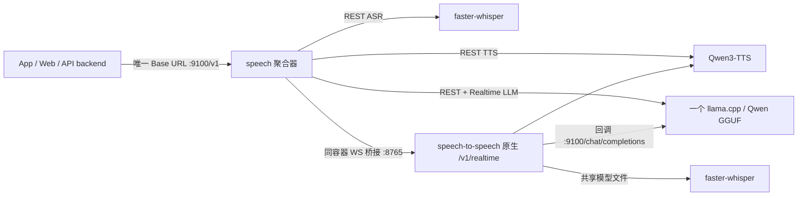

# RealTalk 本地实时语音模型服务器

一个 `speech` 容器：**ASR（faster-whisper）+ LLM（llama.cpp GGUF）+ 统一 Qwen3-TTS +
speech-to-speech Realtime**。对外只暴露一个 **OpenAI 兼容 API** 地址
`http://<IP>:9100/v1`，RealTalk api 后端与管理台无需分别填写内部容器地址。

一次完整语音对话实际经过三种不同模型：

1. **Whisper / ASR**：把麦克风声音转成文字；模型越大通常识别越准、也越慢。
2. **Qwen GGUF / LLM**：理解文字并生成 AI 回复。
3. **TTS**：`/audio/speech` 与 `/realtime` 都使用部署时选择的 **Qwen3-TTS** 模型和音色
   （CPU 默认 0.6B CustomVoice / Q4_K_M）。

## 实际拓扑与复用边界



- **真正进程内共用**：所有 REST 文字请求和 realtime 的 LLM 都走聚合器中的同一个
  llama.cpp / GGUF 实例，不重复加载语言模型。
- **共享下载目录、分别加载**：REST 与 speech-to-speech 是不同的 Python 运行时，不能安全共用
  一个 faster-whisper 内存对象；但两者都使用 `/models/faster-whisper-<size>`，不会重复下载。
- **统一 TTS 配置**：REST 与 realtime 使用相同 Qwen3-TTS 模型、量化和默认 speaker，声音一致。
  原生 S2S 是独立进程，模型文件共用；`SPEECH_S2S_PIPELINES=1` 避免额外复制实时管线。
- 不使用 Python venv：Docker 镜像本身就是隔离环境。`speech-to-speech` 的编排是
  **VAD → STT → LLM → TTS**，不是单一端到端权重。

## 安装

```bash
# setup.sh 里选择「安装本地实时语音模型」即可；或手动（默认原生实时模式）：
COMPOSE_PROFILES=speech docker compose -f docker-compose.yml -f docker-compose.speech.yml up -d --build
```

参数全部走 `.env`（每节点部署项，不入库、不进管理台）：

| 变量 | 默认 | 说明 |
|---|---|---|
| `SPEECH_DEVICE` | `cpu` | `cpu` / `cuda`（GPU 需 nvidia-container-toolkit） |
| `SPEECH_LLAMA_CPU_PORTABLE` | `true` | CPU 源码构建便携 llama.cpp，关闭 AVX2/FMA 以兼容旧 Xeon；设 `false` 可用预编译 wheel 加快镜像构建，但 CPU 必须支持其指令集 |
| `SPEECH_ASR_MODEL` | `small` | whisper 尺寸：tiny/base/small/medium/large-v3 |
| `SPEECH_LLM_REPO` / `SPEECH_LLM_FILE` | Qwen2.5-1.5B-Instruct Q4 | GGUF 模型仓库/文件（FILE 也可填绝对路径） |
| `SPEECH_REALTIME_ENGINE` | `s2s` | `s2s`=speech-to-speech 原生实时通道；`legacy`=应急回退旧内建实现 |
| `SPEECH_TTS_MODEL` | Qwen3-TTS 0.6B CustomVoice | REST 与实时统一模型；质量优先可换 1.7B |
| `SPEECH_TTS_SPEAKER` | `Aiden` | REST 与实时统一音色；中文可填 `Vivian` / `Serena` / `Uncle_Fu` 等 |
| `SPEECH_TTS_QUANT` | `Q4_K_M` | CPU GGUF 量化；降低内存占用 |
| `SPEECH_TTS_ALLOW_REQUEST_VOICE` | `true` | 用户选择同时作用于 REST 与 realtime；单音色部署可设为 `false` |

管理端发布的音色目录会下发到 iOS/Android：本地 0.6B CustomVoice 支持
`Vivian, Serena, Uncle_Fu, Dylan, Eric, Ryan, Aiden, Ono_Anna, Sohee`；OpenAI Realtime
使用 `alloy, ash, ballad, coral, echo, sage, shimmer, verse, marin, cedar`。用户换音色后，
REST 朗读立即生效；实时会话会重连后生效。
| `SPEECH_S2S_PIPELINES` | `1` | 原生实时并发管线数；每条都要加载 ASR/TTS，CPU 请保持 1 |
| `SPEECH_MODELS_DIR` | `./speech-models` | faster-whisper、LLM GGUF、Qwen3-TTS GGUF/HuggingFace 缓存统一持久化目录 |
| `HF_ENDPOINT` | 空 | 受限网络填 `https://hf-mirror.com` |
| `SPEECH_ASR_CONCURRENCY` / `SPEECH_TTS_CONCURRENCY` | 3 / 6 | ASR/TTS 并发上限，超出排队 |
| `SPEECH_LLM_CONCURRENCY` | **1（勿改大）** | llama.cpp 进程内单实例非线程安全，>1 会崩；高并发用 `SPEECH_LLM_BASE_URL` 代理外部 llama-server 或多副本 |
| `SPEECH_LLM_BASE_URL` | 空 | 设了则 LLM 代理外部 OpenAI 兼容服务（不在本进程加载，可并发） |
| `SPEECH_CTX_TTL_SECONDS` | 300 | **仅 legacy**：实时上下文 Redis 滑动 TTL（5 分钟；主动结束即删） |

**实时通道 `WS /v1/realtime`** 由原生 `speech-to-speech` 执行。它保持 OpenAI Realtime 事件，聚合器补齐旧后端需要的词列表/PCM 采样率字段，故现有 App 协议无需改动。两种轮次形态（`session.update` 决定）：
- 默认回合制：`commit` 判停 + `response.create` 触发回复（客户端掌控节奏，用于点按对话/严格场景）；
- `turn_detection={"type":"server_vad"}` 全双工（GPT-Live/OpenAI Realtime 式）：连续上行、服务端 VAD 自动断句+自动回复+起声打断（用于私教沉浸式/实时翻译）。

## API 调用方式（OpenAI 兼容）

```bash
BASE=http://<服务器>:9100/v1

# 1) 语音→文字
curl -F file=@clip.wav -F language=en $BASE/audio/transcriptions        # {"text":"..."}

# 2) 文字→语音（WAV；中英混合自动双音色）
curl -X POST $BASE/audio/speech -H 'Content-Type: application/json' \
     -d '{"input":"Hello 你好","voice":"en_US-lessac-medium"}' -o out.wav

# 3) 文字对话
curl -X POST $BASE/chat/completions -H 'Content-Type: application/json' \
     -d '{"messages":[{"role":"user","content":"Say hi"}]}'

# 4) 实时通道（WS，OpenAI Realtime 事件子集）：同时上传语音流和文字上下文，
#    返回 用户转写 + 文本流 + 语音流；断线后由 API 后端从数据库历史重新播种上下文
wscat -c "$BASE/realtime?session=abc&language=en"
> {"type":"session.update","session":{"instructions":"You are..."}}
> {"type":"conversation.item.create","item":{"role":"user","content":[{"type":"input_text","text":"场景台词..."}]}}
> {"type":"input_audio_buffer.append","audio":"<base64 音频>"}
> {"type":"input_audio_buffer.commit"}
< {"type":"conversation.item.input_audio_transcription.completed","transcript":"..."}
< {"type":"response.text.delta","delta":"..."} ... {"type":"response.audio.delta","delta":"<b64 pcm16>","sample_rate":22050}
```

## 在 RealTalk 中启用（管理台 → 系统设置 → 模型中心）

管理台将模型分成三块：**C·文字推理**、**A·场景 ASR**、**B·对话与声音**。它们按业务分工，
不是重复字段；全本地时三块恰好都可指向同一个 `speech` 服务。所有 Base URL 都只填到
`/v1`，**不要**追加具体端点，例如不要填 `/chat/completions`。

### 填写本地 speech 服务

假设宿主机 IP 为 `192.168.6.3`、端口为 `9100`，管理端应填写：

| 管理端区域 | Base URL | 模型名称 | API Key | 后端实际请求的地址 / 用途 |
|---|---|---|---|---|
| **C·文字推理** | `http://192.168.6.3:9100/v1` | `local` | `local` | `POST /v1/chat/completions`：聊天、评分、学习材料、场景生成；场景生成独立槽位留空即跟随 C |
| **A·场景 ASR** | `http://192.168.6.3:9100/v1` | `whisper-1` | `local` | `POST /v1/audio/transcriptions`：高级会员上传录音 → 转写 → 生成场景 |
| **B·对话与声音** | `http://192.168.6.3:9100/v1` | 留空 | `local` | 自动派生下方四个端点；默认音色填 `Aiden`（英文）或 `Vivian`（中文） |

| B·对话与声音自动派生的本地端点 | 实际能力 |
|---|---|
| `POST http://192.168.6.3:9100/v1/audio/transcriptions` | 练习时用户语音转文字（Whisper） |
| `POST http://192.168.6.3:9100/v1/audio/speech` | AI 台词朗读（Qwen3-TTS） |
| `POST http://192.168.6.3:9100/v1/chat/completions` | 分步语音对话的文字回复（本地 GGUF） |
| `ws://192.168.6.3:9100/v1/realtime` | 沉浸式/私教原生流式：VAD → ASR → LLM → Qwen3-TTS |

### 改用 OpenAI

可以不重启服务，直接保存管理端配置。OpenAI 的 Base URL 固定为
`https://api.openai.com/v1`，API Key 填 OpenAI API Key；不要把浏览器里的 ChatGPT 订阅当作 API Key。

| 管理端区域 | Base URL | 模型名称应填 | 后端实际请求的地址 / 说明 |
|---|---|---|---|
| **C·文字推理** | `https://api.openai.com/v1` | 选择可用文字模型，例如 `gpt-4.1-mini` | `POST /v1/chat/completions`。可为场景生成独立填写更强文字模型。 |
| **A·场景 ASR** | `https://api.openai.com/v1` | `gpt-4o-mini-transcribe`（也可按账号可用模型填写 `whisper-1`） | `POST /v1/audio/transcriptions`。 |
| **B·对话与声音** | `https://api.openai.com/v1` | `gpt-realtime` | 实时连接自动转换为 `wss://api.openai.com/v1/realtime?model=gpt-realtime`；用户可选声音填写 OpenAI Realtime 支持的声音，例如 `marin, cedar, alloy, ash, ballad, coral, echo, sage, shimmer, verse`。 |

当 B 指向 OpenAI 时，应用会自动使用：`/audio/transcriptions`（模型固定为
`whisper-1`）、`/audio/speech`（模型自动为 `gpt-4o-mini-tts`）和上述 Realtime WebSocket。
因此 B 的“对话模型”字段仅用于实时通道，应填 `gpt-realtime`，不是 TTS 或 ASR 模型名。

> B·对话与声音只需要保存一个 Base URL 和 Key：手动对话会调用 ASR/TTS/文本端点；
> 沉浸式/私教优先使用 `/v1/realtime`。若实时连接失败，后端会回退为分步 ASR → LLM → TTS。

## 多活 / 高并发 / k8s

- 默认 s2s 运行时不自行持久会话：API 后端在每次新连接时从数据库播种私教指令与近期历史，断线可恢复；`legacy` 模式才使用 Redis（`spx:ctx:<session>`，5 分钟滑动 TTL）。
- ASR/LLM/TTS 各自并发信号量排队，防止把节点打挂；模型目录可多副本共享（只读加载）；
- k8s：`deploy/k8s/speech-server.yaml`（Deployment+Service+PVC），探针已带 `start-period`（首启要下载模型）。

## 多用户并发与扩容

单节点并发旋钮（全部 env，两种部署方式通用）：

| 旋钮 | 默认 | 说明 |
|---|---|---|
| `SPEECH_ASR_CONCURRENCY` | 3 | REST 转写并发，超出排队 |
| `SPEECH_TTS_CONCURRENCY` | 6 | REST 合成并发，超出排队 |
| `SPEECH_LLM_CONCURRENCY` | **1（勿改）** | 进程内 llama.cpp 非线程安全；要并发 LLM 用下行 |
| `SPEECH_LLM_BASE_URL` | 空 | 指向外部 llama-server/vLLM → LLM 真并发（连续批处理） |
| `SPEECH_S2S_PIPELINES` | 1 | **实时通道并发路数**＝同时进行的私教沉浸式会话数；每路各载一份 ASR+TTS（约 +1.5GB），满了新连接收 session_limit_reached，App 自动降级点按。注：ggml TTS 非线程安全，sitecustomize 会把跨管线的 TTS 合成串行化（VAD/ASR/LLM 仍并行）——否则 Metal 并发编码直接崩进程 |
| API 容器 `WEB_CONCURRENCY` | 4 | FastAPI worker 数（api 服务本身天然多用户并发） |

多服务器/多显卡横向扩容（无需改代码）：

```
App/API 后端 ──> nginx (least_conn + WS 升级透传)
                   ├─> 语音服务器A :9100（Docker+CUDA 或 原生 Metal）
                   ├─> 语音服务器B :9100
                   └─> ...
```

- 管理台「B·对话语音模型」填 nginx 地址即可；REST 无状态可任意分发；
  /v1/realtime 按连接粘滞（一条 WS 全程一台机器），nginx 默认行为即满足。
- GPU 进容器：NVIDIA 显卡用 `DEVICE=cuda` 构建 + nvidia-container-toolkit（Dockerfile 已支持）；
  Apple Silicon 的 GPU 无法映射进容器 → 用 install_native_macos.sh 原生部署（同一份代码）。

在哪配置 `SPEECH_S2S_PIPELINES`：

- **容器部署**：`bash setup.sh` 第 7 步（语音服务器参数）会询问「实时全双工并发路数」，写入 `.env`。
- **原生 macOS**：`~/realtalk-speech/speech.env`（install_native_macos.sh 自动生成模板），
  改完 `launchctl unload/load` 重启生效。
- 不做自动设定：合适的值取决于内存/显存余量与你能接受的每路延迟（每路 +1.5GB、共享同一 GPU），
  属于容量决策；默认 1 保守安全。

单机多卡（重要）：`SPEECH_S2S_PIPELINES` 只是**同一进程内**的多路管线，全部路共享**同一块** GPU——
它不会把负载摊到第二张卡上。多卡的正确姿势是「每张卡一个实例」再用 nginx 汇聚（与多服务器同构）：

```bash
# 卡0 / 卡1 各跑一个 speech 容器，端口错开（同一镜像同一模型目录，权重各载一份）
docker run -d --gpus '"device=0"' -e SPEECH_DEVICE=cuda -e SPEECH_S2S_PIPELINES=2 \
  -p 9100:9100 -v ./speech-models:/models realtalk-speech
docker run -d --gpus '"device=1"' -e SPEECH_DEVICE=cuda -e SPEECH_S2S_PIPELINES=2 \
  -p 9101:9100 -v ./speech-models:/models realtalk-speech
# nginx least_conn → 9100/9101，管理台填 nginx 地址
```
